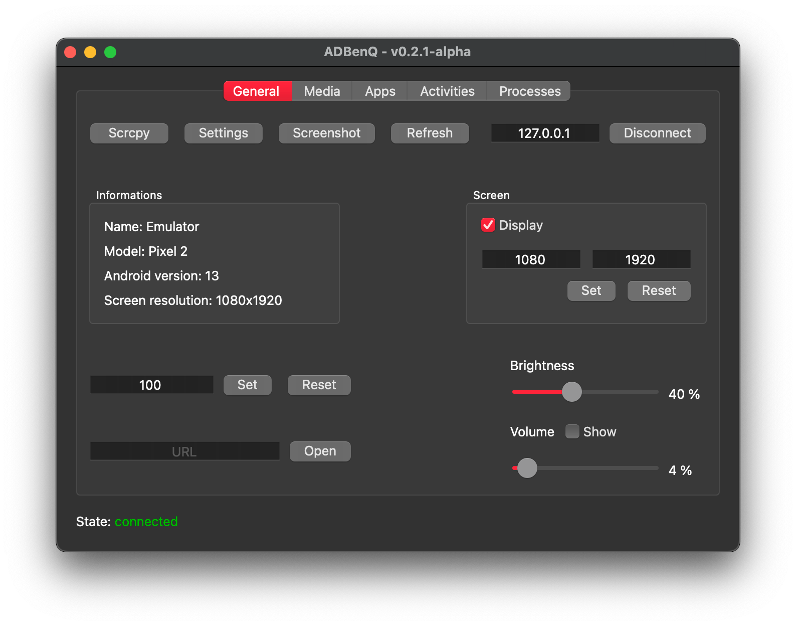

<div align="center">
    
    <h1>ADBenQ</h1>
    
    
    
</div>

<br />

> Version: **0.2.0-alpha**

---

## Table of Contents

- [ℹ️ About](#-about)
- [📋 Requirements](#-requirements)
- [🛠️ Installation](#-installation)
  - [🐍 Using Pip](#-using-pip)
  - [📦 Using Tarball (MacOS)](#-using-tarball-macos)
  - [🐧 Arch Linux and derivatives (AUR)](#-arch-linux-and-derivatives-aur)
    - [💻 Using paru/yay](#-using-paruyay)
    - [🔧 Manually](#-manually)
- [🚀 Usage](#-usage)
- [📚 Documentation](#-documentation)
  - [🌟 Highlight of the Wiki](#-highlight-of-the-wiki)
- [🤝 Contributing](#-contributing)
- [📜 License](#-license)
- [👥 Contributors](#-contributors)
- [🧑‍💻 Author](#-author)

## ℹ️ About

Welcome to **ADBenQ**! 🎉

This is a desktop application built using PySide6 (Qt for Python) to control University BenQ smart TVs via ADB (Android Debug Bridge).

> [!NOTE]
> But hey, let's be real: the true goal of this project is to _learn Qt_ and become a future app developer!
> 🚀 It’s all about the journey of improving skills while building something fun and practical.

Why **ADBenQ**?

- 🖥️ Seamlessly control smart TVs.
- 🛠️ Built with PySide6, mixing UI design and functionality.
- 📚 Detailed documentation to guide you through the app.

## 📋 Requirements

To run **ADBenQ**, you'll need:

- Python 3.9 or later.
- [ADB](https://developer.android.com/tools/adb) installed on your system.
- [Scrcpy](https://github.com/Genymobile/scrcpy) installed on your system.

> [!WARNING]
> Make sure ADB and Scrcpy are accessible from your system's PATH!

## 🛠️ Installation

### 🐍 Using Pip

1. Clone the repository:

   ```bash
   git clone https://github.com/Zarox28/ADBenQ.git
   cd ADBenQ
   ```

2. Install dependencies:

   ```bash
   pip install -r requirements.txt
   ```

3. Run the app:

   ```bash
   python main.py
   ```

4. (Optional) Create a standalone executable:

   ```bash
   pip install pyinstaller
   pyinstaller ADBenQ.spec
   ```

   The executable will be located in the `dist` folder.

### 📦 Using Tarball (MacOS)

1. Download the latest release from the [Releases](https://github.com/Zarox28/ADBenQ/releases) page.

2. Extract the tarball:

   ```bash
   tar -xvf ADBenQ-macos.tar.gz
   cd ADBenQ
   ```

3. Run the app:

   ```bash
    ./ADBenQ
   ```

### 🐧 Arch Linux and derivatives (AUR)

#### 💻 Using paru/yay

```bash
paru -S adbenq-git
```

or

```bash
yay -S adbenq-git
```

#### 🔧 Manually

1. Clone the build scripts from the aur or download snapshot

   ```bash
   git clone https://aur.archlinux.org/adbenq-git.git
   ```

2. Open a terminal inside the cloned directory

3. Run the build scrips using makepkg

   ```bash
   makepkg -si
   ```

## 🚀 Usage

Follow these steps to use ADBenQ:

1. 🚀 Launch the application.
2. 📡 Connect your BenQ TV to the same network as your computer.
3. 🖥️ Enter the TV's IP address in the app interface (if it's not already connected).
4. 🎮 Explore the control options.
5. 🎉 Enjoy the power of controlling your TV from your computer! 🚀

<div align="center">
    
</div>

## 📚 Documentation

Looking for more details about ADBenQ’s features or troubleshooting advice? We've got you covered!

### 🌟 Highlight of the Wiki:

- [General tab](https://github.com/Zarox28/ADBenQ/wiki/General-Tab) - Learn how to connect your TV and general purpose of the app. 📺
- [Media Tab](https://github.com/Zarox28/ADBenQ/wiki/General-Tab) - Control media playback on your TV. 🎥

Check out the [Wiki](https://github.com/Zarox28/ADBenQ/wiki/Home) to make the most out of ADBenQ! 🚀

## 🤝 Contributing

Contributions are welcome! Open an issue or create a pull request to share your ideas. 🤝

## 📜 License

This project is licensed under the AGPL-3.0 License - see the [LICENSE](LICENSE) file for details.

## 👥 Contributors

- **[@0x4c756e61 (Luna)](https://github.com/0x4c756e61)** - Provided the package for Arch Linux and derivatives.

## 🧑‍💻 Author

- **[@Zarox28](https://github.com/Zarox28)**
