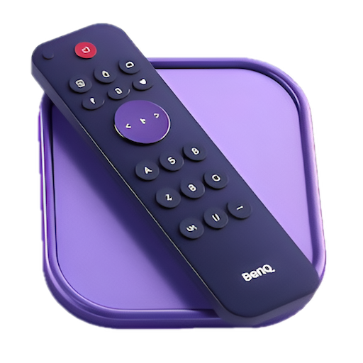
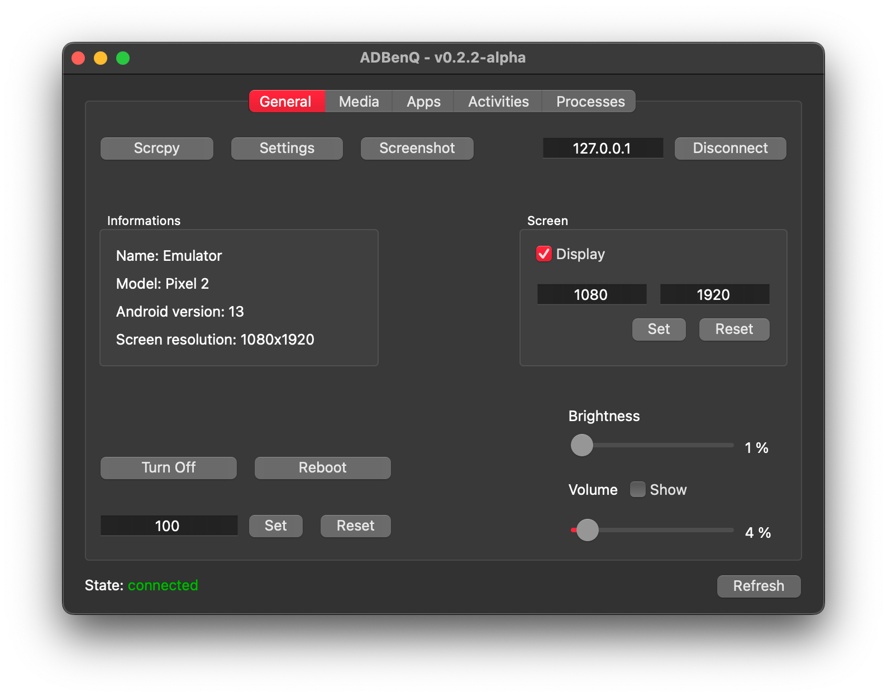

<div align="center">
    
    <h1>ADBenQ</h1>
    
    
    
</div>

<br />

> Version: **0.1.0-alpha**

---

## Table of Contents

- [About](#about)
- [Requirements](#requirements)
- [Installation](#installation)
- [Usage](#usage)
- [Documentation](#documentation)
- [Contributing](#contributing)
- [License](#license)
- [Authors](#authors)

## About

Welcome to **ADBenQ**! 🎉
This is a desktop application built using PySide6 (Qt for Python) to control BenQ smart TVs via ADB (Android Debug Bridge).

> **Note**
> But hey, let's be real: the true goal of this project is to _learn Qt_ and become a future app developer!
> 🚀 It’s all about the journey of improving skills while building something fun and practical.

Why **ADBenQ**?

- 🖥️ Seamlessly control smart TVs.
- 🛠️ Built with PySide6, mixing UI design and functionality.
- 📚 Detailed documentation to guide you through the app.

## Requirements

To run **ADBenQ**, you'll need:

> **Warning**
> Make sure ADB and Scrcpy is installed and accessible from your system's PATH!

- Python 3.9 or later.
- [ADB](https://developer.android.com/tools/adb) installed on your system.
- [Scrcpy](https://github.com/Genymobile/scrcpy) installed on your system.

## Installation

1. Clone the repository:
   
   ```bash
   git clone https://github.com/Zarox28/ADBenQ.git
   cd ADBenQ
   ```

2. Install dependencies:
   
   ```bash
   pip install -r requirements.txt
   ```

3. Run the app:
   
   ```bash
   python main.py
   ```

## Usage

Follow these steps to use ADBenQ:

1. Launch the application by running `python main.py`.
2. Connect your BenQ TV to the same network as your computer.
3. Enter the TV's IP address in the app interface.
4. Explore the control options
5. Enjoy the power of controlling your TV from your computer! 🚀

<div align="center">
    
</div>

## Documentation 📚

Looking for more details about ADBenQ’s features or troubleshooting advice? We've got you covered!

### Highlight of the Wiki:

- [Features](https://github.com/Zarox28/ADBenQ/wiki/Features) - Discover the app's functionalities and how to use them.

Check out the Wiki to make the most out of ADBenQ! 🚀

## Contributing

Contributions are welcome! Open an issue or create a pull request to share your ideas. 🤝

## License

This project is licensed under the AGPL-3.0 License - see the [LICENSE](LICENSE) file for details.

## Author

- **[@Zarox28](https://github.com/Zarox28)**
